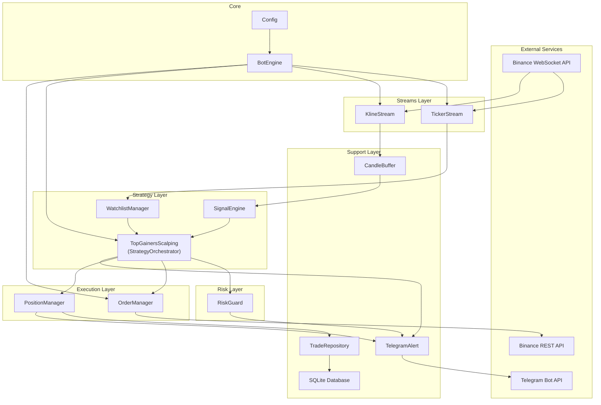
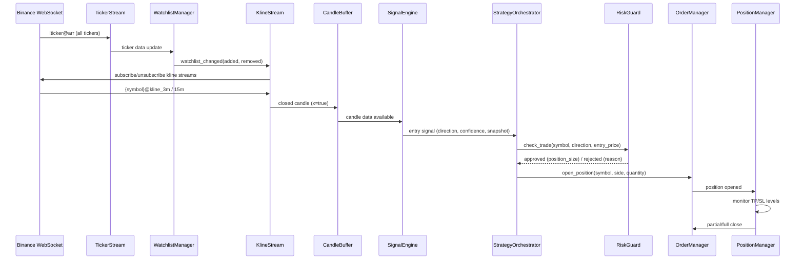
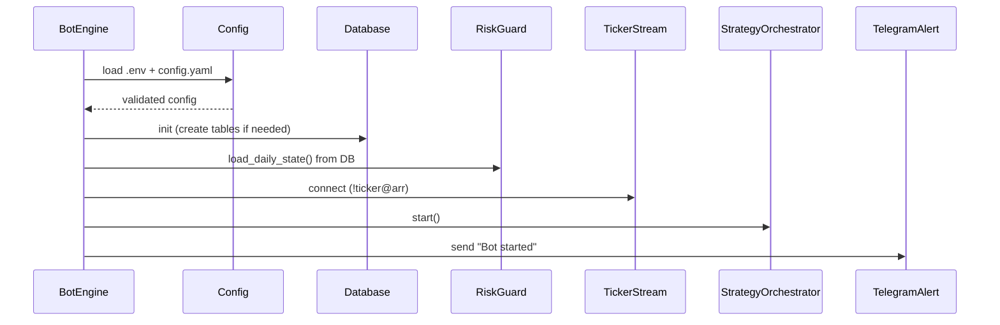
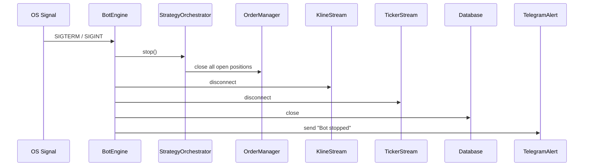

# Design Document: crypto-scalp-bot

## Overview

crypto-scalp-bot is an automated scalping bot for Binance USDT-M Perpetual Futures. It dynamically selects the top gaining symbols, monitors them via WebSocket streams, and executes trades using multi-signal confirmation with progressive take-profit levels and strict risk management.

The system is built on an async Python architecture using `asyncio` as the event loop. All I/O — WebSocket streams, REST API calls, database writes, and Telegram notifications — runs cooperatively on a single event loop. Components communicate through an in-process event/callback pattern rather than message queues, keeping the system simple and latency-low.

### Key Design Decisions

1. **Single-process async architecture**: All components run in one asyncio event loop. This avoids IPC complexity and keeps state management straightforward. The bot is I/O-bound (waiting on WebSocket messages, API responses), so a single process with async I/O is sufficient.

2. **In-memory state with SQLite persistence**: Open positions, candle buffers, and risk state are held in memory for fast access. SQLite provides durable storage for trade history and daily stats. On startup, the bot rehydrates risk state from the database.

3. **Event-driven component communication**: Components use async callbacks (e.g., `on_watchlist_changed`, `on_candle_closed`, `on_position_closed`) rather than polling. This reduces latency and simplifies the control flow.

4. **python-binance AsyncClient**: The `python-binance` library provides both async REST client and WebSocket manager for Binance Futures, supporting testnet/mainnet switching via a `testnet` flag on `AsyncClient.create()`.

5. **pandas_ta for indicators**: All technical indicator calculations use `pandas_ta` on pandas DataFrames, providing well-tested implementations of RSI, EMA, and volume moving averages.

---

## Architecture

### High-Level Architecture



### Data Flow



### Startup Sequence



### Shutdown Sequence



---

## Components and Interfaces

### 1. Config (`core/config.py`)

Loads and validates configuration from `.env` and `config.yaml` using `pydantic-settings`.

```python
class EnvSettings(BaseSettings):
    """Loaded from .env file."""
    binance_api_key: str
    binance_api_secret: str
    binance_testnet: bool = False
    telegram_bot_token: str
    telegram_chat_id: str
    db_path: str = "./data/trades.db"
    log_level: str = "INFO"

    model_config = SettingsConfigDict(env_file=".env")

class WatchlistConfig(BaseModel):
    top_n: int = 5
    min_change_pct_24h: float = 3.0
    min_volume_usdt_24h: float = 10_000_000
    refresh_interval_sec: int = 300
    max_concurrent_positions: int = 3
    blacklist: list[str] = []
    blacklist_patterns: list[str] = []

class EntryConfig(BaseModel):
    rsi_period: int = 14
    rsi_long_min: float = 50
    rsi_long_max: float = 70
    rsi_short_min: float = 30
    rsi_short_max: float = 50
    ema_fast: int = 9
    ema_slow: int = 21
    ema_trend_fast: int = 20
    ema_trend_slow: int = 50
    volume_multiplier: float = 1.5
    resistance_buffer_pct: float = 0.3
    signal_cooldown_min: int = 15

class ExitConfig(BaseModel):
    tp1_pct: float = 0.8
    tp2_pct: float = 1.5
    tp3_pct: float = 2.5
    tp1_close_ratio: float = 0.4
    tp2_close_ratio: float = 0.4
    trailing_stop_pct: float = 0.5
    sl_pct: float = 1.0
    max_hold_min: int = 30

class RiskConfig(BaseModel):
    risk_per_trade_pct: float = 1.0
    leverage: int = 5
    max_concurrent_positions: int = 3
    max_daily_loss_pct: float = 3.0
    max_drawdown_pct: float = 5.0
    min_free_margin_pct: float = 30.0

class StrategyConfig(BaseModel):
    signal_timeframe: str = "3m"
    trend_timeframe: str = "15m"
    candle_buffer_size: int = 100
    entry: EntryConfig = EntryConfig()
    exit: ExitConfig = ExitConfig()

class AppConfig(BaseModel):
    watchlist: WatchlistConfig
    strategy: StrategyConfig
    risk: RiskConfig
```

**Interface:**
- `load_config() -> tuple[EnvSettings, AppConfig]` — loads `.env` and `config.yaml`, validates, returns both config objects. Raises `SystemExit` on validation failure.

### 2. BotEngine (`core/bot.py`)

Entry point that wires all components and manages the bot lifecycle.

**Interface:**
- `async start() -> None` — initializes DB, loads risk state, connects streams, starts strategy
- `async stop() -> None` — closes positions, disconnects streams, closes DB
- Signal handlers for SIGTERM/SIGINT that trigger `stop()`

### 3. TickerStream (`streams/ticker_stream.py`)

Subscribes to the `!ticker@arr` WebSocket stream for market-wide ticker data.

**Interface:**
- `async connect() -> None` — opens WebSocket connection to `!ticker@arr`
- `async disconnect() -> None` — closes the WebSocket connection
- `on_ticker_update: Callable[[list[TickerData]], None]` — callback invoked on each ticker array message

### 4. WatchlistManager (`strategy/watchlist_manager.py`)

Filters and ranks symbols based on ticker data, manages the active watchlist.

**Interface:**
- `update_tickers(tickers: list[TickerData]) -> None` — receives raw ticker data, stores latest snapshot
- `async refresh() -> None` — re-ranks symbols, applies filters, emits changes
- `get_active_symbols() -> list[str]` — returns current watchlist
- `has_open_position(symbol: str) -> bool` — checks grace policy via PositionManager reference
- `on_watchlist_changed: Callable[[list[str], list[str]], Awaitable[None]]` — callback with (added, removed)

### 5. KlineStream (`streams/kline_stream.py`)

Manages per-symbol kline WebSocket subscriptions.

**Interface:**
- `async subscribe(symbol: str) -> None` — subscribes to `{symbol}@kline_3m` and `{symbol}@kline_15m`
- `async unsubscribe(symbol: str) -> None` — unsubscribes from both kline streams
- `on_candle_closed: Callable[[str, str, dict], Awaitable[None]]` — callback with (symbol, timeframe, candle_data)

### 6. CandleBuffer (`utils/candle_buffer.py`)

Rolling buffer storing recent candles per symbol per timeframe.

**Interface:**
- `add(symbol: str, timeframe: str, candle: dict) -> None` — appends candle, evicts oldest if at capacity
- `get_df(symbol: str, timeframe: str) -> pd.DataFrame` — returns DataFrame with columns: open, high, low, close, volume, timestamp
- `has_enough_data(symbol: str, timeframe: str, min_candles: int) -> bool` — checks if buffer has sufficient data
- `clear(symbol: str) -> None` — removes all data for a symbol

### 7. SignalEngine (`strategy/signal_engine.py`)

Calculates technical indicators and generates entry signals.

**Interface:**
- `evaluate(symbol: str, df_3m: pd.DataFrame, df_15m: pd.DataFrame) -> Signal | None` — evaluates all entry conditions, returns Signal or None
- Signal dataclass: `Signal(direction: SignalDirection, confidence: float, indicators: dict)`

### 8. TopGainersScalping / StrategyOrchestrator (`strategy/top_gainers_scalping.py`)

Coordinates signal evaluation, risk checks, and order placement.

**Interface:**
- `async start() -> None` — begins listening for candle close events
- `async stop() -> None` — stops the strategy loop
- `async on_candle_closed(symbol: str, timeframe: str) -> None` — triggered on each closed candle
- `async close_all_positions() -> None` — force-closes all open positions (for shutdown/halt)

### 9. OrderManager (`execution/order_manager.py`)

Places and manages orders via the Binance REST API.

**Interface:**
- `async set_leverage(symbol: str, leverage: int) -> None`
- `async open_position(symbol: str, side: OrderSide, quantity: float) -> OrderResult`
- `async close_position(symbol: str, side: OrderSide, quantity: float) -> OrderResult`
- Retry logic: up to 3 retries with exponential backoff on API errors

### 10. PositionManager (`execution/position_manager.py`)

Tracks open positions in memory and manages TP/SL levels.

**Interface:**
- `open(symbol: str, side: OrderSide, entry_price: float, quantity: float, leverage: int) -> Position`
- `async check_exits(symbol: str, current_price: float) -> None` — evaluates TP1/TP2/TP3/SL/time-based exits
- `get_open_positions() -> list[Position]` — returns all open positions
- `has_position(symbol: str) -> bool`
- `on_position_closed: Callable[[TradeResult], Awaitable[None]]` — callback with trade result

### 11. RiskGuard (`risk/risk_guard.py`)

Enforces portfolio-level risk limits.

**Interface:**
- `async load_daily_state() -> None` — loads daily stats from DB
- `check_trade(entry_price: float, balance: float) -> RiskCheckResult` — returns approved with position_size or rejected with reason
- `record_pnl(pnl_usdt: float) -> None` — updates daily loss and session drawdown
- `is_halted() -> bool`

### 12. TradeRepository (`storage/trade_repository.py`)

CRUD operations for trade history and daily stats.

**Interface:**
- `async insert_trade(trade: TradeRecord) -> int` — inserts open trade, returns ID
- `async close_trade(trade_id: int, exit_data: ExitData) -> None` — updates trade with exit info
- `async update_daily_stats(date: str, pnl: float, is_win: bool) -> None`
- `async get_daily_stats(date: str) -> DailyStats | None`

### 13. TelegramAlert (`notification/telegram_alert.py`)

Sends event notifications to Telegram.

**Interface:**
- `async send(message: str) -> None` — sends a message, logs failure without raising
- Helper methods: `notify_started()`, `notify_stopped()`, `notify_watchlist_changed(added, removed)`, `notify_position_opened(...)`, `notify_position_closed(...)`, `notify_risk_halt(reason, value)`, `notify_reconnected(duration_sec)`

### 14. Database (`storage/database.py`)

SQLite connection management and schema migrations.

**Interface:**
- `async init() -> None` — creates tables if they don't exist
- `async get_connection() -> aiosqlite.Connection`
- `async close() -> None`

---

## Data Models

### Enums (`core/enums.py`)

```python
from enum import Enum

class SignalDirection(str, Enum):
    LONG = "LONG"
    SHORT = "SHORT"

class OrderSide(str, Enum):
    BUY = "BUY"
    SELL = "SELL"

class ExitReason(str, Enum):
    TP1 = "TP1"
    TP2 = "TP2"
    TP3 = "TP3"
    SL = "SL"
    TIME = "TIME"
    REVERSAL = "REVERSAL"
    HALT = "HALT"

class PositionStatus(str, Enum):
    OPEN = "OPEN"
    CLOSED = "CLOSED"
```

### Core Data Structures

```python
from dataclasses import dataclass, field
from datetime import datetime

@dataclass
class TickerData:
    symbol: str
    price_change_pct: float  # 24h price change %
    last_price: float
    quote_volume: float      # 24h quote volume in USDT

@dataclass
class Signal:
    direction: SignalDirection
    confidence: float
    indicators: dict          # snapshot of all indicator values

@dataclass
class Position:
    symbol: str
    side: SignalDirection
    entry_price: float
    quantity: float
    original_quantity: float
    leverage: int
    tp1_price: float
    tp2_price: float
    tp3_price: float
    sl_price: float
    tp1_hit: bool = False
    tp2_hit: bool = False
    trailing_active: bool = False
    trailing_price: float = 0.0
    opened_at: datetime = field(default_factory=datetime.utcnow)
    trade_id: int = 0

@dataclass
class TradeRecord:
    symbol: str
    side: str
    entry_price: float
    quantity: float
    leverage: int
    entry_at: datetime
    signal_snapshot: str      # JSON string
    status: str = "OPEN"

@dataclass
class ExitData:
    exit_price: float
    pnl_usdt: float
    pnl_pct: float
    exit_reason: ExitReason
    exit_at: datetime

@dataclass
class TradeResult:
    trade_id: int
    symbol: str
    side: str
    entry_price: float
    exit_price: float
    pnl_usdt: float
    pnl_pct: float
    exit_reason: ExitReason

@dataclass
class RiskCheckResult:
    approved: bool
    position_size: float = 0.0
    reject_reason: str = ""

@dataclass
class DailyStats:
    date: str
    starting_balance: float
    total_trades: int
    winning_trades: int
    total_pnl_usdt: float
    max_drawdown_pct: float
    halted: bool
```

### Database Schema

**trades table:**

| Column | Type | Constraints |
|--------|------|-------------|
| id | INTEGER | PRIMARY KEY AUTOINCREMENT |
| symbol | TEXT | NOT NULL |
| side | TEXT | NOT NULL (LONG/SHORT) |
| entry_price | REAL | NOT NULL |
| exit_price | REAL | |
| quantity | REAL | NOT NULL |
| leverage | INTEGER | NOT NULL |
| pnl_usdt | REAL | |
| pnl_pct | REAL | |
| exit_reason | TEXT | TP1/TP2/TP3/SL/TIME/REVERSAL/HALT |
| entry_at | DATETIME | NOT NULL |
| exit_at | DATETIME | |
| status | TEXT | DEFAULT 'OPEN' |
| signal_snapshot | TEXT | JSON string |
| created_at | DATETIME | DEFAULT CURRENT_TIMESTAMP |

**daily_stats table:**

| Column | Type | Constraints |
|--------|------|-------------|
| id | INTEGER | PRIMARY KEY AUTOINCREMENT |
| date | TEXT | NOT NULL UNIQUE (YYYY-MM-DD) |
| starting_balance | REAL | |
| ending_balance | REAL | |
| total_trades | INTEGER | DEFAULT 0 |
| winning_trades | INTEGER | DEFAULT 0 |
| total_pnl_usdt | REAL | DEFAULT 0 |
| max_drawdown_pct | REAL | DEFAULT 0 |
| halted | INTEGER | DEFAULT 0 |
| created_at | DATETIME | DEFAULT CURRENT_TIMESTAMP |


---

## Correctness Properties

*A property is a characteristic or behavior that should hold true across all valid executions of a system — essentially, a formal statement about what the system should do. Properties serve as the bridge between human-readable specifications and machine-verifiable correctness guarantees.*

### Property 1: Configuration validation accepts valid configs and rejects invalid configs

*For any* configuration dictionary that satisfies all pydantic schema constraints (correct types, required fields present, values within valid ranges), `load_config()` shall return a valid `AppConfig` object. *For any* configuration dictionary that violates at least one constraint, `load_config()` shall raise a validation error.

**Validates: Requirements 1.3, 1.4**

### Property 2: Watchlist filter correctness

*For any* set of ticker data and any valid filter configuration (blacklist, blacklist_patterns, min_change_pct_24h, min_volume_usdt_24h), every symbol in the WatchlistManager's filtered output shall satisfy ALL of the following: (a) symbol name ends with "USDT", (b) symbol is not in the blacklist, (c) symbol name does not contain any blacklist pattern, (d) 24h price change % ≥ min_change_pct_24h, (e) 24h quote volume ≥ min_volume_usdt_24h, (f) last price > 0.0001. Furthermore, no symbol satisfying all criteria shall be excluded from the output.

**Validates: Requirements 3.2, 3.3, 3.4, 3.5, 3.6, 3.7**

### Property 3: Watchlist top-N sorting

*For any* list of qualifying symbols with length ≥ 1 and any `top_n` value, the WatchlistManager's selected symbols shall be sorted in descending order by 24h price change percentage, and the list length shall be `min(len(qualifying), top_n)`.

**Validates: Requirements 3.8**

### Property 4: Grace policy retention

*For any* watchlist refresh where a symbol has an open position, that symbol shall remain in the active watchlist regardless of whether it still qualifies by ranking or filter criteria.

**Validates: Requirements 3.9**

### Property 5: Watchlist change diff correctness

*For any* old watchlist and new watchlist, the emitted `added` list shall equal `new - old` (set difference) and the emitted `removed` list shall equal `old - new` (set difference), excluding symbols retained by grace policy.

**Validates: Requirements 3.10**

### Property 6: Closed candle forwarding

*For any* kline WebSocket message, the KlineStream shall forward the candle to the CandleBuffer if and only if the `x` field is `true`. Messages with `x=false` shall not be forwarded.

**Validates: Requirements 4.3**

### Property 7: CandleBuffer size invariant and FIFO ordering

*For any* sequence of candle additions to a CandleBuffer with configured `max_size`, the buffer size for any (symbol, timeframe) pair shall never exceed `max_size`. When the buffer is at capacity and a new candle is added, the oldest candle shall be evicted. The returned DataFrame shall have columns: open, high, low, close, volume, timestamp, and the rows shall be in chronological order.

**Validates: Requirements 5.1, 5.2, 5.3**

### Property 8: LONG signal generation

*For any* 3-minute and 15-minute DataFrames where all LONG entry conditions are simultaneously true (15m EMA_20 > EMA_50, 3m RSI_14 ∈ [50, 70], 3m EMA_9 crossed above EMA_21 within last 2 candles, volume > vol_ma20 × volume_multiplier, bullish candle, close < resistance × (1 - buffer)), the SignalEngine shall return a Signal with direction=LONG, a confidence score > 0, and a non-empty indicators snapshot dictionary.

**Validates: Requirements 6.3, 6.5**

### Property 9: SHORT signal generation

*For any* 3-minute and 15-minute DataFrames where all SHORT entry conditions are simultaneously true (15m EMA_20 < EMA_50, 3m RSI_14 ∈ [30, 50], 3m EMA_9 crossed below EMA_21 within last 2 candles, volume > vol_ma20 × volume_multiplier, bearish candle, close > support × (1 + buffer)), the SignalEngine shall return a Signal with direction=SHORT, a confidence score > 0, and a non-empty indicators snapshot dictionary.

**Validates: Requirements 6.4, 6.5**

### Property 10: Cooldown suppression

*For any* symbol with an active cooldown timer (time since last entry < signal_cooldown_min), the StrategyOrchestrator shall suppress all entry signals for that symbol. Once the cooldown expires, signals shall no longer be suppressed.

**Validates: Requirements 7.5**

### Property 11: TP/SL level calculation

*For any* entry price > 0 and any trade direction (LONG or SHORT), the PositionManager shall set: TP1 = entry_price × (1 ± tp1_pct/100), TP2 = entry_price × (1 ± tp2_pct/100), TP3 = entry_price × (1 ± tp3_pct/100), SL = entry_price × (1 ∓ sl_pct/100), where + is used for LONG TPs and SHORT SL, and - is used for SHORT TPs and LONG SL.

**Validates: Requirements 8.1**

### Property 12: TP1 partial close and breakeven

*For any* open position where the current price reaches the TP1 level, the PositionManager shall close exactly `tp1_close_ratio` fraction of the position quantity AND move the stop loss to the entry price (breakeven).

**Validates: Requirements 8.2, 8.3**

### Property 13: TP2 partial close

*For any* open position where TP1 has already been hit and the current price reaches the TP2 level, the PositionManager shall close exactly `tp2_close_ratio` fraction of the original position quantity.

**Validates: Requirements 8.4**

### Property 14: TP3 trailing stop activation

*For any* open position where TP2 has already been hit and the current price reaches the TP3 level, the PositionManager shall activate a trailing stop at `trailing_stop_pct` percentage from the highest price (LONG) or lowest price (SHORT) reached since TP3 activation.

**Validates: Requirements 8.5**

### Property 15: Stop loss full close

*For any* open position where the current price reaches the SL level, the PositionManager shall close the entire remaining position quantity.

**Validates: Requirements 8.6**

### Property 16: Time-based force close

*For any* open position where the elapsed time since entry exceeds `max_hold_min` minutes, the PositionManager shall force close the entire remaining position regardless of current price or TP/SL state.

**Validates: Requirements 8.7**

### Property 17: Position size formula

*For any* positive balance, positive entry price, and valid risk configuration (risk_per_trade_pct > 0, sl_pct > 0), the RiskGuard shall calculate position_size = (balance × risk_per_trade_pct / 100) / (entry_price × sl_pct / 100). The result shall always be a positive finite number.

**Validates: Requirements 9.1**

### Property 18: Risk approval/rejection correctness

*For any* risk state (daily_loss, session_drawdown, open_position_count, free_margin_pct) and risk configuration, the RiskGuard shall approve a trade if and only if ALL of the following hold: (a) daily_loss < max_daily_loss_pct, (b) session_drawdown < max_drawdown_pct, (c) open_position_count < max_concurrent_positions, (d) free_margin_pct ≥ min_free_margin_pct. When rejected, the result shall identify the specific failing condition.

**Validates: Requirements 9.2, 9.3**

### Property 19: Risk halt trigger

*For any* daily loss value exceeding `max_daily_loss_pct` OR any session drawdown value exceeding `max_drawdown_pct`, the RiskGuard shall enter the halted state and reject all subsequent trade requests until reset.

**Validates: Requirements 9.4, 9.5**

### Property 20: Position opened notification completeness

*For any* position opened event with valid data, the TelegramAlert notification message shall contain the symbol, direction, entry price, position size, stop loss price, and TP1 target price.

**Validates: Requirements 11.2**

### Property 21: Position closed notification completeness

*For any* position closed event with valid data, the TelegramAlert notification message shall contain the symbol, exit reason, and PnL in USDT.

**Validates: Requirements 11.3**

---

## Error Handling

### Exchange API Errors

| Error Scenario | Handling Strategy |
|---|---|
| Order placement failure | Retry up to 3 times with exponential backoff (1s, 2s, 4s). Log each attempt. After 3 failures, log error and skip the trade. Do not crash. |
| Leverage setting failure | Retry up to 3 times. If all fail, skip the trade and log warning. |
| Insufficient balance | RiskGuard pre-check should prevent this. If it occurs, log error, reject trade, do not retry. |
| Rate limiting (HTTP 429) | Respect `Retry-After` header. Back off and retry. |
| API key invalid (HTTP 401) | Log critical error. Enter halt state. Send Telegram alert. |

### WebSocket Errors

| Error Scenario | Handling Strategy |
|---|---|
| Connection lost | Exponential backoff reconnection: 1s → 2s → 4s → 8s → 16s → 30s (max). |
| Disconnect > 60 seconds | Close all open positions via OrderManager. Send Telegram alert. Continue reconnection attempts. |
| Malformed message | Log warning with message content. Skip message. Do not crash. |
| Subscription failure | Log error. Retry subscription on next watchlist refresh cycle. |

### Telegram Errors

| Error Scenario | Handling Strategy |
|---|---|
| API unreachable | Log warning. Continue bot operation. Do not block or crash. |
| Rate limited | Queue messages with backoff. Drop oldest if queue exceeds 100 messages. |
| Invalid token | Log error on startup. Bot continues without notifications. |

### Database Errors

| Error Scenario | Handling Strategy |
|---|---|
| Database file locked | aiosqlite handles this via its thread-based approach. Retry with short delay. |
| Disk full | Log critical error. Enter halt state (cannot persist trades safely). |
| Schema migration failure | Log critical error. Terminate bot with non-zero exit code. |
| Corrupt database | Log critical error. Terminate bot. Require manual intervention. |

### Configuration Errors

| Error Scenario | Handling Strategy |
|---|---|
| Missing .env file | pydantic-settings raises ValidationError. Log error. Terminate with exit code 1. |
| Missing config.yaml | Log error. Terminate with exit code 1. |
| Invalid config values | pydantic validation catches these. Log specific validation errors. Terminate with exit code 1. |

### Strategy Errors

| Error Scenario | Handling Strategy |
|---|---|
| Insufficient candle data | SignalEngine returns None. StrategyOrchestrator skips evaluation. Log debug message. |
| Indicator calculation error (NaN) | SignalEngine detects NaN in indicators. Returns None. Log warning. |
| Position size calculation yields 0 | RiskGuard rejects trade with reason "calculated position size too small". |

---

## Testing Strategy

### Testing Framework

- **Unit tests**: `pytest` with `pytest-asyncio` for async test support
- **Property-based tests**: `hypothesis` library for Python
- **Mocking**: `unittest.mock` / `pytest-mock` for external dependencies (Binance API, Telegram API)
- **Database tests**: In-memory SQLite via `aiosqlite` with `:memory:` connection

### Test Organization

```
tests/
├── conftest.py                    # Shared fixtures (config, mock clients)
├── test_config.py                 # Config loading and validation
├── test_watchlist_manager.py      # Watchlist filtering, sorting, grace policy
├── test_signal_engine.py          # Indicator calculation, signal generation
├── test_candle_buffer.py          # Buffer operations, size invariant
├── test_position_manager.py       # TP/SL management, partial closes
├── test_risk_guard.py             # Position sizing, risk checks, halt logic
├── test_order_manager.py          # Order placement, retry logic
├── test_trade_repository.py       # CRUD operations, daily stats
├── test_telegram_alert.py         # Notification formatting, error handling
├── test_kline_stream.py           # Candle forwarding logic
├── properties/                    # Property-based tests
│   ├── test_watchlist_props.py    # Properties 2-5
│   ├── test_candle_buffer_props.py # Property 7
│   ├── test_signal_engine_props.py # Properties 8-9
│   ├── test_position_manager_props.py # Properties 11-16
│   ├── test_risk_guard_props.py   # Properties 17-19
│   └── test_telegram_props.py     # Properties 20-21
└── integration/
    ├── test_bot_lifecycle.py      # Startup/shutdown sequence
    ├── test_trade_flow.py         # End-to-end trade flow with mocks
    └── test_websocket_reconnect.py # Reconnection behavior
```

### Property-Based Testing Configuration

- Library: `hypothesis` (Python)
- Minimum iterations: 100 per property test (`@settings(max_examples=100)`)
- Each property test must reference its design document property via tag comment
- Tag format: `# Feature: crypto-scalp-bot, Property {number}: {property_text}`

### Unit Test Coverage

Unit tests focus on:
- **Specific examples**: Known input/output pairs for indicator calculations
- **Edge cases**: Empty DataFrames, zero prices, boundary RSI values (exactly 50, exactly 70)
- **Error conditions**: API failures, missing config, malformed WebSocket messages
- **Integration points**: Component wiring, event callback invocation

### Integration Test Coverage

Integration tests verify:
- Bot startup sequence (DB init → risk state load → stream connect → strategy start)
- Graceful shutdown (close positions → disconnect streams → close DB)
- End-to-end trade flow: ticker → watchlist → kline → signal → risk check → order → position → exit
- WebSocket reconnection with re-subscription
- Database persistence across bot restarts

### What Is NOT Property-Tested

- WebSocket connection management (integration with external service)
- Binance REST API calls (external service behavior)
- Telegram API calls (external service behavior)
- Docker deployment configuration (infrastructure)
- Log file rotation (loguru configuration)
- Database CRUD operations (simple persistence, tested via integration tests)
